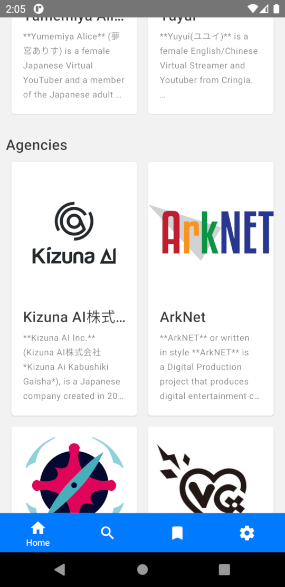
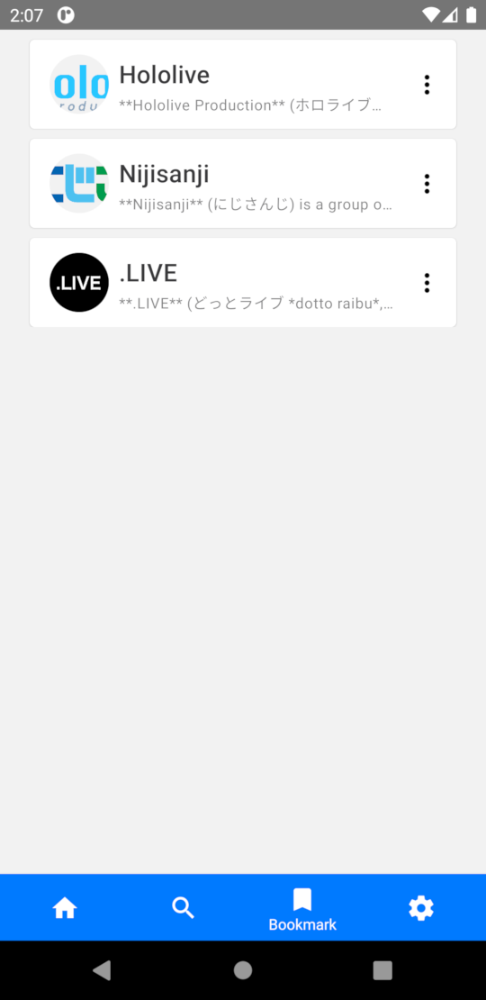

# VTuber Handbook
A mobile directory for Virtual YouTubers.

Features:
1. Basic information, Official Channel/SNS links, short descriptions of over 1400 VTubers.
2. Search with VTuber names.
3. Bookmark your favorite VTubers.
4. Discover random VTubers from front page.
5. Weekly spotlight from Reddit.

This application requires internet access to load images. The default version will load images dynamically from Fandom. If you prefer not loading online images, please see [Build app yourself](#build-app-yourself) below.

Please let me know if there is a bug or if there are any features that you think would benefit this application.

The application has been tested with Android 7 (and later).

# Installation
This application can be found on Google Play:

* Google Play and the Google Play logo are trademarks of Google LLC.

APK downloads can also be found under Github Release section.

## Build app yourself
#### Preparations
- Install `nodejs` and `npm`: <https://nodejs.org/en/download/>
- Clone this repository and run `npm install`.
   - Change `embeddedImages` to `true` in `config.ts` and overwrite `wiki-data.db` with `wiki-data_embedded.db` from release, if you wish to load offline images.
#### Build
- Run `npx react-native run-android --variant=release` and you will find your generated apk file in `android/app/build/outputs/apk/release`.

## Screenshots

## Credits
Textural materials in this application are collected from the [Virtual YouTuber Wiki](https://virtualyoutuber.fandom.com) at Fandom and are licensed under the [Creative Commons Attribution-Share Alike License](https://creativecommons.org/licenses/by-sa/3.0/).

## License
See [LICENSE](LICENSE.md).

Built with React Native .
